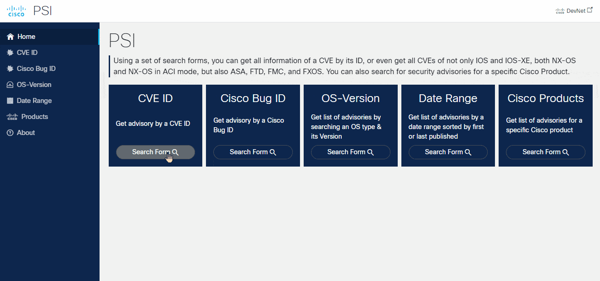
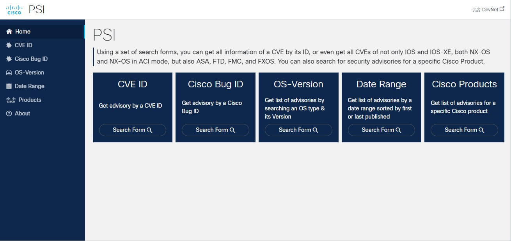

[](https://developer.cisco.com/codeexchange/github/repo/Tes3awy/PSIRT)
[](https://developer.cisco.com/devenv/?id=devenv-vscode-base&GITHUB_SOURCE_REPO=https://github.com/Tes3awy/PSIRT)
[](https://api.securityscorecards.dev/projects/github.com/Tes3awy/PSIRT)
[](https://github.com/psf/black)
[](https://pycqa.github.io/isort/)

# Cisco PSIRT OpenVuln API Web App



Cisco PSIRT is a web-based application that takes advantage of the Cisco PSIRT OpenVuln RESTful API to search for CVEs, show all its data, and related information from other sites, not only to easily identify the CVE and its workarounds (if provided) but also to get all possible solutions at one place and to be up to date with any security vulnerability.

> **This web app is your Google's search engine but for Cisco CVEs.**

# Breaking Changes

On Mar 2, 2023, certain changes were made to the Cisco API console which will make all applications created prior to Mar 1, 2023 deprecated by Sep 30, 2023. More detailed instructions can be found [here](https://github.com/api-at-cisco/Images/blob/master/Whats_New_Doc.pdf).

> **These changes are already applied to the code in this repo.**

## Table of Contents

1. [Features](#features)
2. [Solution Components](#solution-components)
3. [Usage](#usage)
4. [Installation](#installation)
5. [Docker](#docker)
6. [Vagrant](#vagrant)
7. [Screenshots](#screenshots)
8. [Documentation](#documentation)
9. [Use Case](#use-case)
10. [Considerations](#considerations)

## Features

- Using a set of search forms, you can get all information of a CVE by its ID, or even get all CVEs of not only IOS and IOS-XE, both NX-OS and NX-OS in ACI mode, but also ASA, FTD, FMC, and FXOS. You can also search for security advisories for a specific Cisco Product.
- Support for Date range search.
- Cisco authentic look and feel.
- Fully Responsive on mobile devices.
- Extensive error handling.
- Docker application.
- Support for Vagrant box.
- Easy access with no login required. _(Might be added later)_

## Solution Components

### Backend Components

1. [Python](https://www.python.org/downloads/) (Tested on 3.9, 3.10, 3.11)
2. [Flask](https://flask.palletsprojects.com/en/2.2.x/) (The web framework)
3. [Flask-WTF](https://flask-wtf.readthedocs.io/en/1.0.x/) (For forms and server-side validation)
4. [Flask-Limiter](https://flask-limiter.readthedocs.io/en/stable/) (For Rate-Limiting)
5. [Redis](https://redis.io/) (For storing the Rate Limit in production deployment. `Disabled in development`)
6. [Requests](https://requests.readthedocs.io/en/latest/) (To send HTTP requests for API endpoints)
7. [Requests-OAuthlib](https://requests.readthedocs.io/en/latest/community/recommended/#requests-oauthlib) (To perform OAuth2 authentication with Cisco API Console application)

### Frontend Components

1. [Cisco UI Kit 2.0.5](https://www.cisco.com/web/fw/cisco-ui/2.0.5/dist/css/cui-standard.min.css)
2. [jQuery 3.7.1](https://jquery.com/download/)
3. [ScrollReveal.js 4.0.9](https://scrollrevealjs.org/)
4. [Select2.js 4.1.0-rc.0](https://select2.org/)

## Usage

Tested on:

1. Windows 10/11 Pro
2. Ubuntu Server - Jammy 22.04.3 LTS

## Installation

1. Clone or download.

```bash
$ git clone https://github.com/Tes3awy/PSIRT.git
$ cd PSIRT
```

2. Create a virtual environment and install requirements.

```bash
$ python3 -m venv .venv --upgrade-deps
$ source .venv/bin/activate
$ python3 -m pip install wheel
$ python3 -m pip install -r requirement.txt
```

3. Create a `config.py` next to `wsgi.py`.

```bash
$ cd PSIRT
$ touch config.py
$ sudo nano config.py
```

To be able to use PSI, you must register a Cisco API console application to get both `CLIENT_ID` and `CLIENT_SECRET`. And to register a Cisco PSIRT OpenVuln API application on Cisco API Console:

1. [Register a New App](https://apiconsole.cisco.com/apps/myapps) on Cisco API console.
2. Provide an Application Name _(Example: Cisco PSIRT Flask App)_
3. Application Type: `Service`.
4. Grant Type: `Client Credentials`.
5. Select APIs: `Cisco PSIRT openVuln API`.
6. Agree to the [terms of service](https://apiconsole.cisco.com/apps/tos) and click `Register`.

Copy both `KEY` and `CLIENT_ID` to `config.py`

4. Paste the following snippet `config.py`.

```python
class Config(object):
    APP_ENV = "development"
    DEBUG = True
    TESTING = False
    BASE_URL = "https://apix.cisco.com/security/advisories/v2"  # New URL
    CLIENT_ID = "<KEY>"  # Key From https://apiconsole.cisco.com/apps/myapps
    CLIENT_SECRET = "<YOUR_CISCO_CLIENT_SECRET>"  # CLIENT SECRET From https://apiconsole.cisco.com/apps/myapps
    # You can run: python -c 'import secrets; print(secrets.token_hex())' twice to get two secret keys for the following secret keys.
    SECRET_KEY = "<A_SECRET_KEY>"
    WTF_CSRF_SECRET_KEY = "<A_SECRET_KEY_FOR_WTF_FORMS>"
    RATELIMIT_STORAGE_URI = "memory://"


class ProductionConfig(Config):
    APP_ENV = "production"
    DEBUG = False
    RATELIMIT_STORAGE_URI = "redis://localhost:6379" # Change to MongoDB or Memcached depending on your choice
    RATELIMIT_STRATEGY = "fixed-window"
    RATELIMIT_KEY_PREFIX = "PSI"
    RATELIMIT_IN_MEMORY_FALLBACK_ENABLED = True
```

5. Open terminal and run:

```bash
$ cd PSIRT
$ flask run
```

You should get the development webserver up and running:

```
$ flask run -p 8080 -h 0.0.0.0

* Serving Flask app 'run.py'
 * Debug mode: on
WARNING: This is a development server. Do not use it in a production deployment. Use a production WSGI server instead.
 * Running on all addresses (0.0.0.0)
 * Running on http://127.0.0.1:8080
 * Running on http://xxx.xxx.x.x:8080
Press CTRL+C to quit
 * Restarting with stat
 * Debugger is active!
 * Debugger PIN: xxx-xxx-xxx

```

6. Open `localhost:8080/main` in your browser and you are ready to use the application.

**To deploy PSI in a production environment**

Change the following line in `psiapp/__init__.py`

```python
...

def create_app(config_class=ProductionConfig):  # this line
    app = Flask(__name__)
    ...
```

## Docker

You can build and run the application in a Docker container

1. Replace `Config` with `ProductionConfig` at line 19 in `psiapp/__init__.py`

```bash
$ cd PSIRT
$ docker build --progress=plain --no-cache -t psirt:latest .
$ docker run -d -p 80:80 --name psi psirt
```

2. Open `localhost:80/main` _(port 80 this time which is the default port for HTTP)_ in your browser and you are ready to use your production-ready dockerized application.

## Vagrant

You might want to create an virtual machine instead of a docker container. You can easily deploy the application as I have added `Vagrantfile`, `setup.sh`, `nginx.conf`, `supervisor.conf` which you can use to instantly deploy your application in an Ubuntu VM.

All you need have is [Vagrant](https://developer.hashicorp.com/vagrant/downloads) installed on your machine, and then run the following command.

> Make sure you are using `ProductionConfig` in the `__init__.py` script. (Can be done at any time)

```bash
$ cd PSIRT
$ vagrant up --provider vmware_desktop
```

> If you are using VMware as your provider, make sure you have the [VMware Utility](https://developer.hashicorp.com/vagrant/docs/providers/vmware/vagrant-vmware-utility)

Once Vagrant finishes installation, you will get an IP address displayed in the terminal. Open that IP in you browser.

```bash
<output_truncated>
    default: Restarted supervisord
    default: 192.168.64.134
```

> You can also deploy the app on [Virtualbox](https://www.virtualbox.org/). Run `vagrant up --provider virtualbox` instead

## Screenshots

|                           |                                      |                                       |
| :-----------------------: | :----------------------------------: | :-----------------------------------: |
|   |             |            |
|  |  |  |

## Documentation

1. [Cisco PSIRT OpenVuln API Documentation](https://developer.cisco.com/docs/psirt/)
2. [API Reference](https://developer.cisco.com/docs/psirt/#!api-reference)
3. [Cisco API Console - What's New](https://github.com/api-at-cisco/Images/blob/master/Whats_New_Doc.pdf)
4. [PSIRT Knowledge Base](https://devnetsupport.cisco.com/hc/en-us/sections/115002851487-openVuln-API)

## Use Case

- You are working in an organization where you have to patch vulnerabilites in your Cisco Catalyst/Nexus switches or FTD. You can use `os - version` search form.
- You want to search for advisories in a specific period of time. You can use `Date Range` search form.
- You get an email from InfoSec to check some CVEs. You search on Google, but you get a bunch of irrelevant results and you don't know which one to open. This application narrows down the results to what exactly needed with all links related to Cisco.
- You get an email from a customer with a list of CVEs, who has little to no knowledge about CVEs. You don't want to spend your time searching for these CVEs and they are in a hurry. This application is handy in these situations. You get your job done in a couple of minutes and the customer is satisfied with your swift response.

## Considerations

Some versions of Python _(such as 3.10.x)_, may; or may not; `raise` an `ssl.SSLError: [SSL: UNSAFE_LEGACY_RENEGOTIATION_DISABLED] unsafe legacy renegotiation disabled (_ssl.c:1131)` exception. It's crucial to handle this error in a proper way since it is considered a critical security and audit breaks for a Man-in-the-Middle attack if handled incorrectly.

You can carefully add the following line at the very bottom of `/etc/ssl/openssl.cnf`

```bash
[system_default_sect]
CipherString = DEFAULT:@SECLEVEL=2
Options = UnsafeLegacyRenegotiation # This line
```

> And restart the webserver. This change will be removed if openssl is upgraded. **Do it at your own risks!**

## Authors

- **Osama Abbas** - [Tes3awy](https://github.com/Tes3awy)

## Disclaimer

Code provided as-is. No warranty implied or included. Use the code for production at your own risk.
